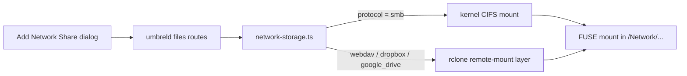

# Upstream pull request draft — Network storage beyond SMB

Use this document when opening a PR against [getumbrel/umbrel](https://github.com/getumbrel/umbrel).

**Suggested branch name:** `feat/network-storage-rclone`  
**Suggested PR title:** `feat(files): add WebDAV and cloud storage to Network via rclone`

---

## Summary

Extends **Files → Network** beyond SMB/CIFS with a small **rclone remote-mount layer**. Users can mount:

| Protocol | Backend | Auth |
| --- | --- | --- |
| **SMB** (existing) | kernel `cifs` | username / password |
| **WebDAV** | rclone | username / password |
| **Dropbox** | rclone | OAuth (`rclone authorize`) |
| **Google Drive** (`google_drive`) | rclone | OAuth (`rclone authorize`) |

All remotes appear under `/Network/<host>/<share>` in Files, same as SMB shares today.

SMB stays on kernel CIFS for LAN performance. New protocols go through rclone so we can add more backends (SFTP, S3, etc.) without new kernel mount code.

## Motivation

Today umbrelOS only supports SMB network shares. Many users have:

- NAS devices with **WebDAV** (Synology, QNAP, Nextcloud)
- **Dropbox** / **Google Drive** accounts they want to browse alongside local files
- Other rclone-supported remotes in the future

This PR adds those paths through one shared mount abstraction instead of one-off integrations.

## Architecture



**New module:** `packages/umbreld/source/modules/files/remote-mount/`

- `rclone.ts` — write per-share config, `rclone mount` / unmount, cache dir
- `webdav.ts` — vendor detection (`other` / `nextcloud`)
- `cloud-oauth.ts` — `rclone authorize` sessions for Dropbox / Google Drive
- `types.ts` — shared types; `RcloneBackend` already includes `sftp` for future work

**Persistence**

- rclone config: `${dataDirectory}/secrets/rclone/<mount-id>.conf` (mode `0600`)
- VFS cache: `${dataDirectory}/cache/rclone-vfs/<mount-id>`
- OAuth tokens stored in the umbrel store with shares (not returned by `getShareInfo`)

**OS image**

- `rclone` + `fuse3` in `umbrelos.Dockerfile`
- `user_allow_other` in `packages/os/overlay/etc/fuse.conf`

## UI

`Add network share` dialog protocol picker:

1. **SMB** — existing wizard (Avahi discovery + manual)
2. **WebDAV** — URL, credentials, optional label, Nextcloud auto-detect
3. **Dropbox** / **Google Drive** — optional label, OAuth connect flow with polling

Cloud OAuth opens an auth URL from rclone. The callback listens on `127.0.0.1` on the device; the UI shows an SSH tunnel hint when signing in from another computer.

## API changes

| Route | Description |
| --- | --- |
| `files.addNetworkShare` | Union extended with `webdav`, `dropbox`, `google_drive` |
| `files.startCloudNetworkAuth` | Start `rclone authorize` session |
| `files.getCloudNetworkAuthStatus` | Poll OAuth completion |

Store schema: `files.networkStorage[].protocol` adds `webdav \| dropbox \| google_drive`, plus optional `url`, `vendor`, `token`.

## Testing

- **Unit:** `remote-mount/*.unit.test.ts`, `network-storage.webdav.unit.test.ts` (URL host-key parsing)
- **Integration:** `network-storage-webdav.integration.test.ts` (skipped without `rclone` + `/dev/fuse`)
- **CI:** installs `rclone` before umbreld tests

```bash
cd packages/umbreld
npm test -- source/modules/files/remote-mount/ source/modules/files/network-storage.webdav.unit.test.ts
```

## Known limitations / follow-ups

1. **Cloud OAuth callback** — rclone binds to localhost on the Umbrel device. Remote sign-in needs SSH port forwarding or a future headless/token-based flow.
2. **Performance** — rclone FUSE is slower than kernel SMB on LAN; acceptable trade-off for WebDAV/cloud.
3. **More backends** — `types.ts` already lists `sftp`; adding UI + `build*Remote` helpers should be straightforward.
4. **Single Google Drive account per share** — multiple shares with different labels are supported; re-auth replaces token per share.

## Scope note for upstream

This draft covers **network storage only** (5 commits). It does **not** include Raspberry Pi external USB storage changes from the community fork. To propose only this feature upstream:

```bash
git fetch upstream
git checkout -b feat/network-storage-rclone upstream/master
git cherry-pick 0dc2a952 93c38270 17166fc3 b4a27464 0c7f10da
# resolve conflicts if any, then push and open PR on getumbrel/umbrel
```

Commit subjects:

1. `Add WebDAV network storage via rclone remote-mount layer`
2. `Harden WebDAV and network storage for production use`
3. `Complete WebDAV rollout: locales, Nextcloud vendor, CI`
4. `Add Dropbox and Google Drive as network storage via rclone OAuth`
5. `Rename drive protocol to google_drive`

## Checklist

- [x] SMB behaviour unchanged
- [x] WebDAV mount/unmount + watch loop remount
- [x] Dropbox / Google Drive OAuth + mount
- [x] Locales (29 languages; en source strings)
- [x] Secrets not exposed via `getShareInfo`
- [x] OS packages (`rclone`, `fuse3`, `fuse.conf`)
- [ ] Manual QA on Umbrel Home / Pi with real NAS WebDAV
- [ ] Manual QA: Dropbox + Google Drive OAuth end-to-end

## Screenshots

_Add before opening upstream PR:_

1. Protocol picker (SMB / WebDAV / Dropbox / Google Drive)
2. WebDAV credentials form
3. Cloud OAuth “Connect account” + auth URL step
4. Mounted share under Files → Network
